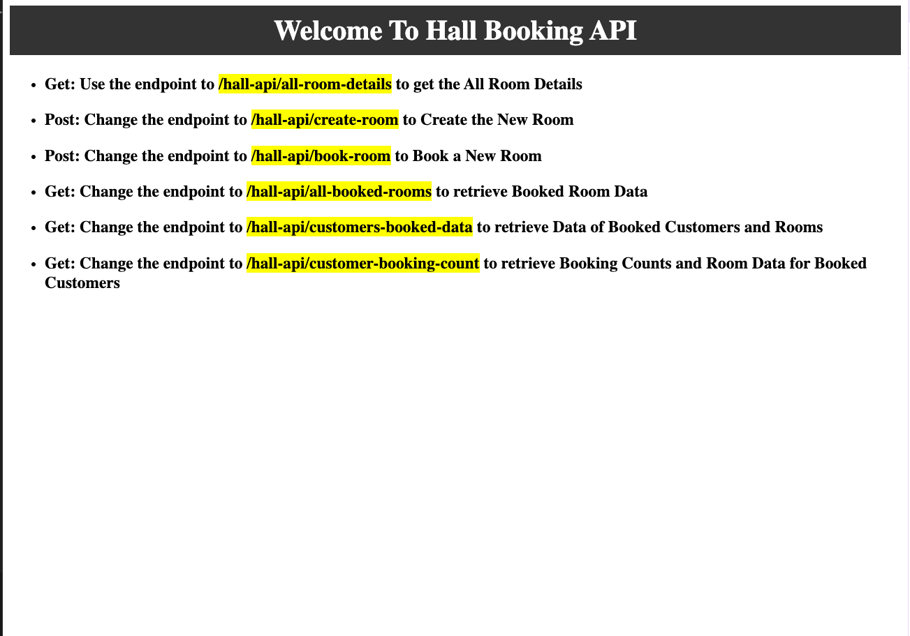
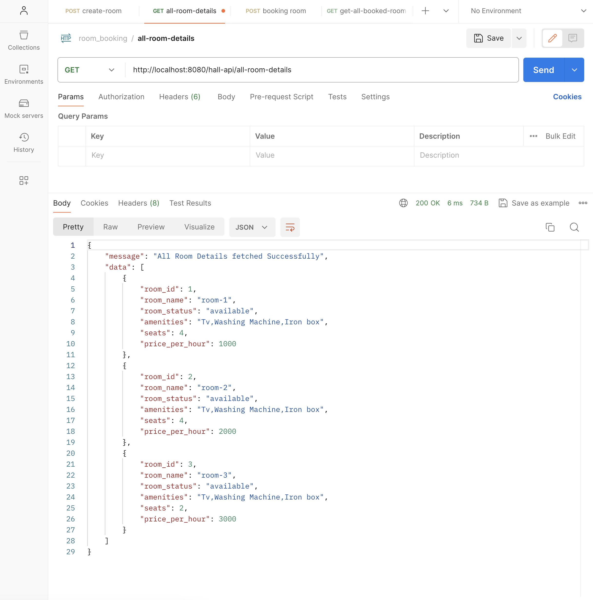
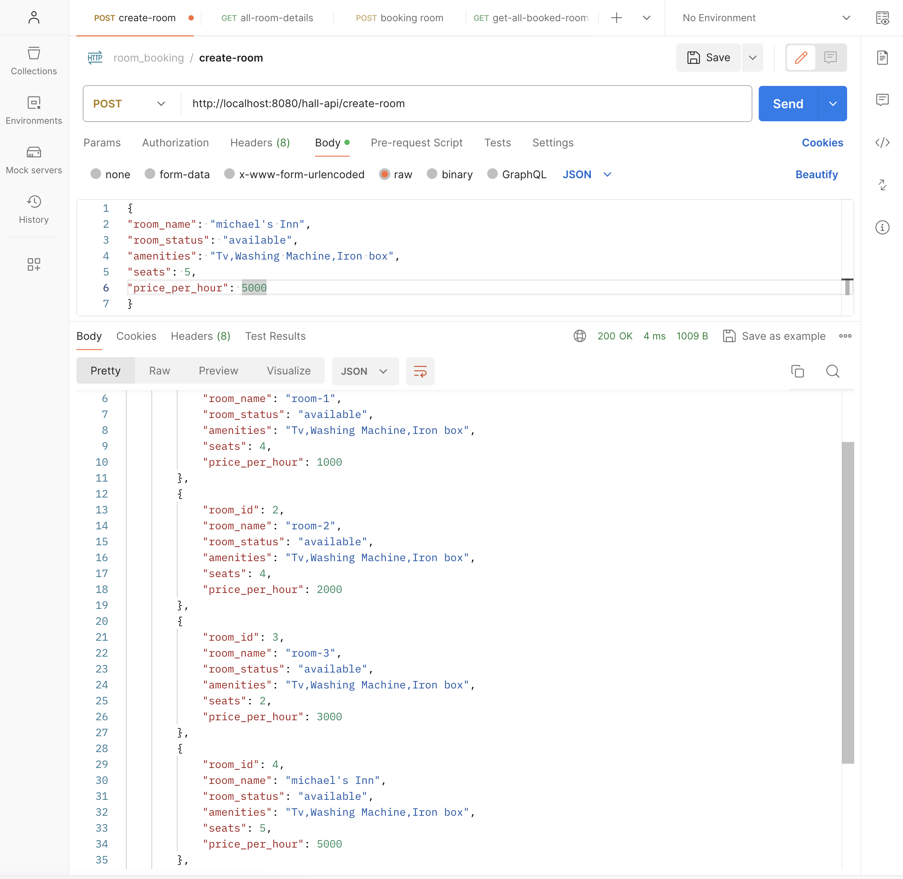
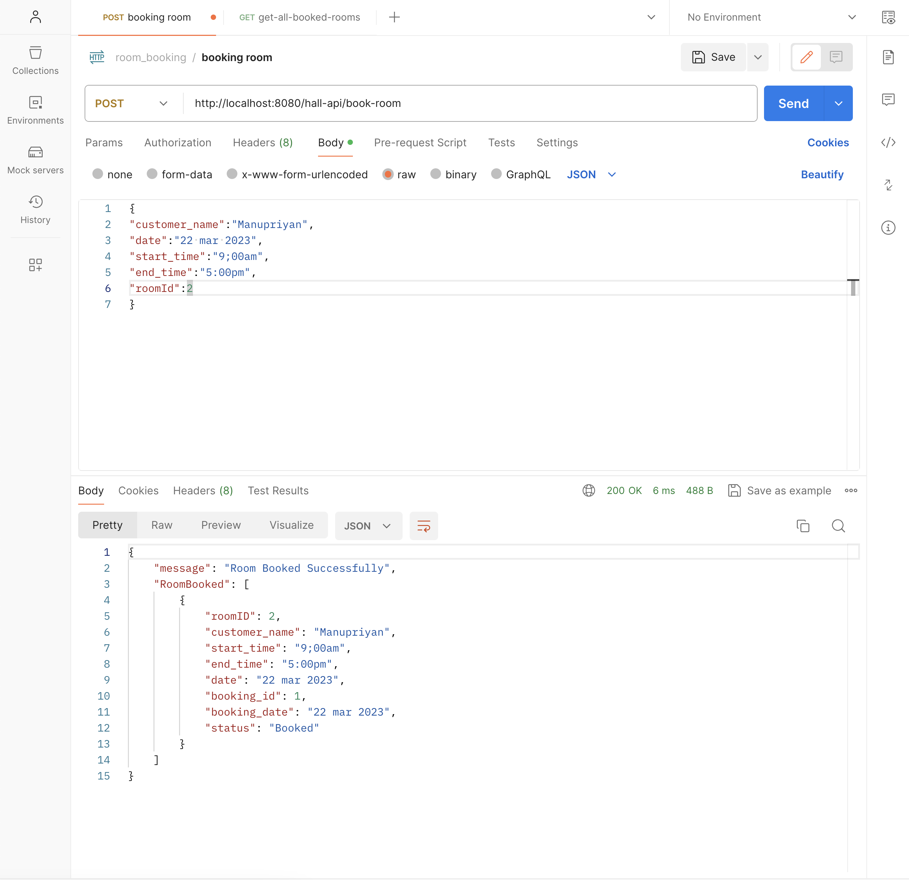
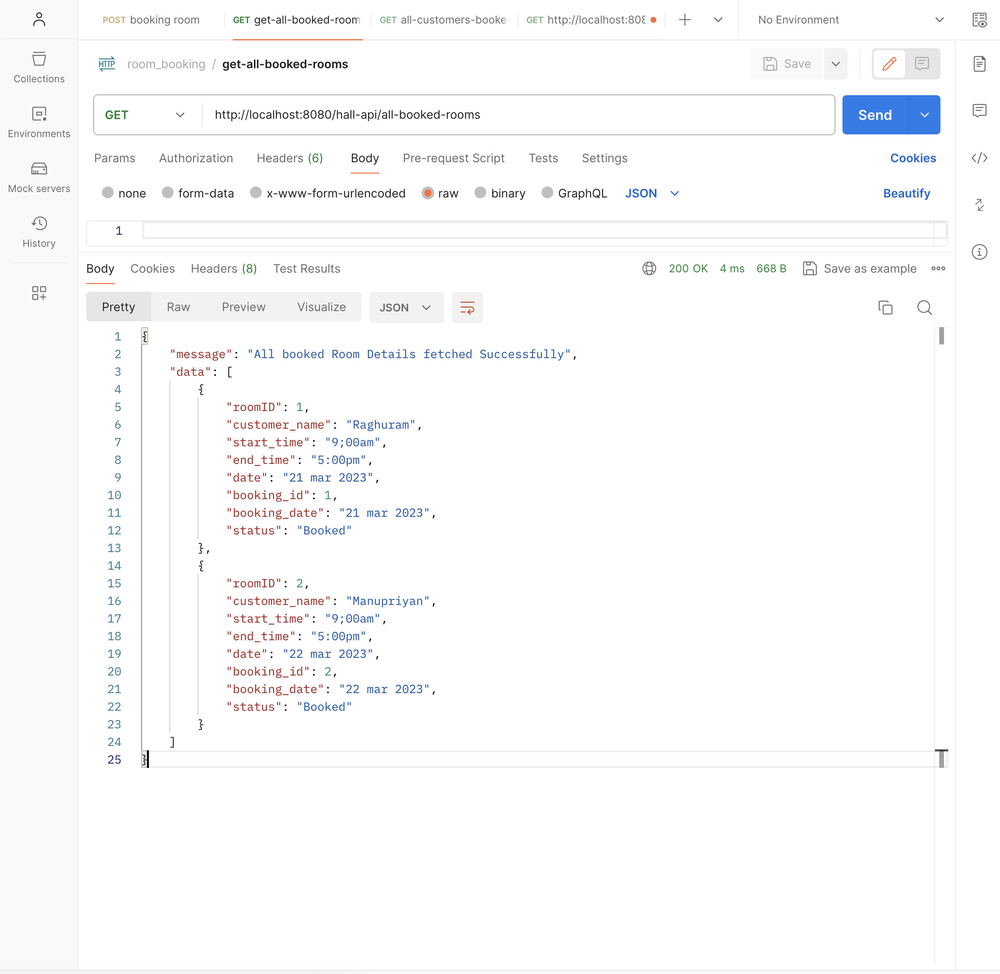
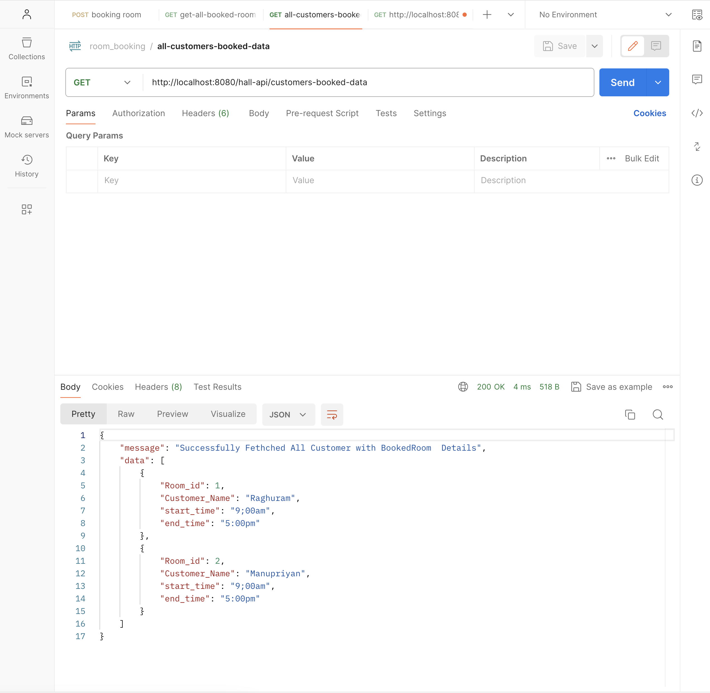
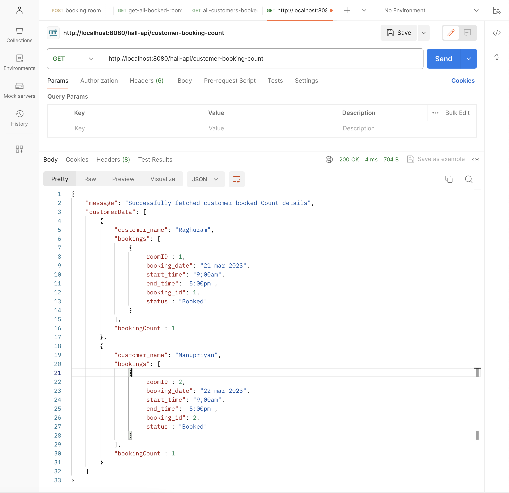

# Hall Booking API

This is an Express.js application for managing bookings and rooms at Hall API.

## Table of Contents

- [Usage](#usage)
- [Endpoints](#endpoints)
- [Demo](#demo)

## Endpoints

### GET /

- **Description:** Returns a welcome message and instructions on how to use the API.
  

### GET /hall-api/all-room-details

**Description:** Retrieves details of all available rooms.

### POST /hall-api/create-room

- **Description:** Creates a new room.

  

### POST /hall-api/book-room

- **Description:** Books a room for a customer.
  

### GET /hall-api/all-booked-rooms

- **Description:** Retrieves data of all booked rooms.
  

### GET /hall-api/customers-booked-data

- **Description:** Retrieves data of all customers with booked room details.
  

### GET /hall-api/customer-booking-count

- **Description:** Retrieves booking details for each customer along with booking count.
  

## Demo

Access the live demo [Hall-Booking-API](https://hall-booking-api-1b89.onrender.com/).
